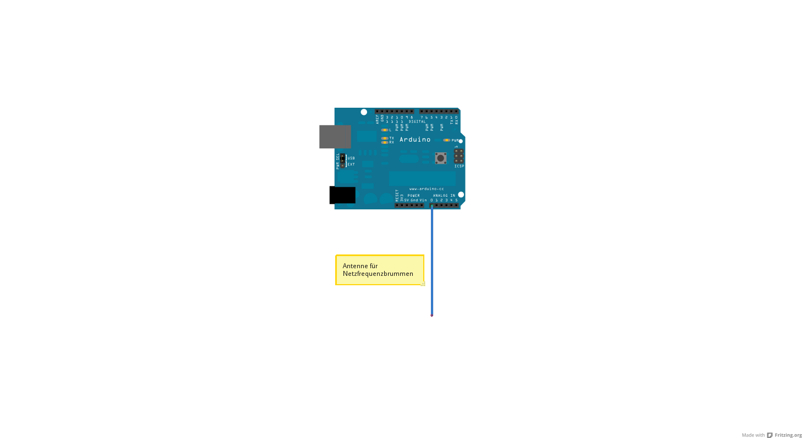

# Bestimmung der Netzfrequenz mittels Arduino

Dieser kleine Sketch zeigt wie man mittels einer einfachen kurzen Antenne
an einem Analog-Port des Arduinos die aktuelle Netzfrequenz des Stromnetzes
messen kann.

Die Messung der Netzfrequenz kann interessant sein, um zu beobachten ob momentan genug
oder zu wenig Strom ins Netz eingespeist wird.
Wird zu wenig Strom eingespeist, so sinkt die Netzfrequenz.
Wird zu viel Strom eingespeist, so steigt die Netzfrequenz.

## Programm

An Port A0 wird einfach ein kurzes Stück Draht (beispielsweise 10cm) angeschlossen.
Das andere Ende des Drahtes wird offen gelassen, son fungiert der Draht als Antenne und 
Port A0 "empfaengt" dann ein verrauschtes Netzbrummen.

Im Programm wird der zeitliche Abstand der Minmumdurchgänge dieses Brummen gmessen, was
der Periodendauer entspricht.
Aus dem Kehrwert der Periodendauer ergibt sich dann die Frequenz.

Um die Sache etwas genauer zu machen wird die Zeit für 50 Period gemessen und dann
gemittelt.

Die gemessene Frequenz kann dann mit der Frequenz von http://www.netzfrequenzmessung.de/
verglichen werden.

Bei meinen Versuchen hat sich gezeigt, dass es eine Abweichung zwischen der von mir gemessenen
Frequenz und der "offiziellen" Netzfrequenz gibt.
Woran diese Abweichung liegt ist mir momentan noch nicht klar.

Ich kann mir momentan folgende Ursachen hierfuer denken:
* Eine Abweichung des Quartz auf dem Arduino-Board
* Fehlende Interrupts fuer die Bestimmung der "micros()"; vielleicht durch die A/D-Wandlung

(Falls irgendjemand eine Idee, kann er mich gerne √ueber GitHub kontaktieren. Danke.)

## Schaltungsaufbau

